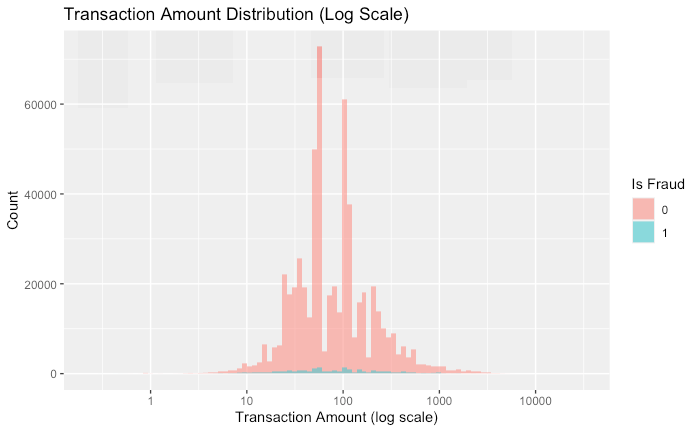
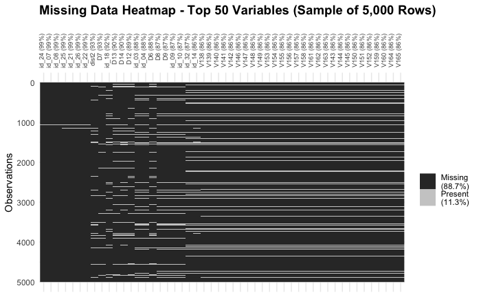
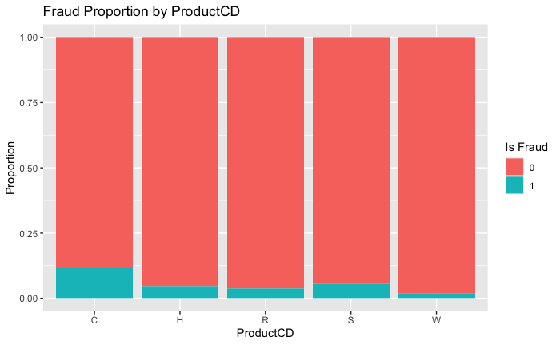
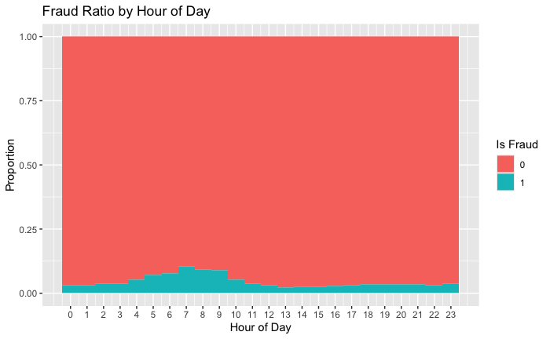
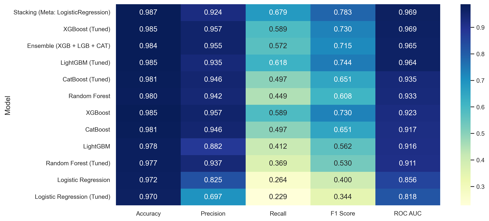

## 📌 Project Overview

This project implements a complete machine learning pipeline to detect fraudulent transactions using the [IEEE-CIS dataset](https://www.kaggle.com/c/ieee-fraud-detection). It includes:

- Deep EDA in **R** and **Python**
- Robust preprocessing and feature engineering
- Ensemble modeling (XGBoost, LightGBM, CatBoost)
- A FastAPI deployment for real-time predictions
- Unit testing with `pytest` for pipeline robustness

🚀 Check the full repository: [GitHub](https://github.com/alexmatiasas/Fraud-Detection-with-ML)

---

## 🔍 Exploratory Data Analysis

Full notebook: [RPubs EDA report](https://rpubs.com/Alex_matias_as/fraud-detection-eda)

To lay the foundation for modeling, we explored class balance, missingness, temporal patterns and categorical signals—selecting only the most actionable insights below.

---

### 1. Class Imbalance



- **96.5 %** non-fraud vs. **3.5 %** fraud  
- Baseline models were trained on raw data to measure “lift” from later oversampling/threshold tuning

---

### 2. Missing-Value Patterns



- Many `id_` & `Vxxx` features > 85 % missing  
- Suggests dropping or engineering “missingness” flags before modeling

---

### 3. Categorical Fraud Rates



- **Product C** has ~12 % fraud rate vs. ~3 % overall  
- `Discover` cards and `mobile` devices also show elevated risk

---

### 4. Temporal Signal



- Fraud peaks around **6 – 9 AM** (UTC)  
- No strong day-of-week effect, but morning flag can improve feature set

---

### Key Takeaways

- **Severe imbalance** (3.5 % fraud) → plan SMOTE/threshold tuning  
- **High missingness** in many features → use missingness indicators or drop  
- **Strong categorical drivers** (ProductCD, card networks) → prioritize in feature engineering  
- **Temporal window** matters → add `IsMorning`/`IsNight` flags

---

## 🔧 Data Preprocessing Pipeline

Full notebook: [02_Preprocessing_Modeling_in_Python.ipynb](https://github.com/alexmatiasas/Fraud-Detection-with-ML/blob/main/notebooks/02_Preprocessing_Modeling_in_Python.ipynb)

To prepare the IEEE-CIS dataset for modeling, we built a simple, reproducible pipeline that applies:

- 📥 **Missing-value imputation**  
  - Numerical → median  
  - Categorical → most frequent  
- 🔤 **Categorical encoding**  
  - `LabelEncoder` per column, saved to `models/label_encoders.pkl`  
- 📏 **Feature scaling**  
  - `StandardScaler` on all numeric features, saved to `models/scaler.pkl`  
- 💾 **Data export**  
  - Cleaned DataFrame written to `data/processed/train_clean.csv`

> **Pseudocode overview**  
> ```python
> # 1) Impute
> df[num_cols] = SimpleImputer('median').fit_transform(df[num_cols])
> df[cat_cols] = SimpleImputer('most_frequent').fit_transform(df[cat_cols])
>
> # 2) Encode
> for col in cat_cols:
>     df[col] = LabelEncoder().fit_transform(df[col].astype(str))
>
> # 3) Scale
> df[num_cols] = StandardScaler().fit_transform(df[num_cols])
>
> # 4) Persist transformers and cleaned data
> joblib.dump(scaler, 'models/scaler.pkl')
> joblib.dump(encoders, 'models/label_encoders.pkl')
> df.to_csv('data/processed/train_clean.csv', index=False)
> ```

**Why this matters**

- **Reproducibility:** Same exact logic runs in both notebooks and the FastAPI service.  
- **Modularity:** Transformers are versioned via `joblib`, so you can swap in SMOTE, PCA or any new step later without touching your API.  
- **Performance:** Full preprocess on ~590 K × 434 data executes in seconds, keeping your inference path lightweight.

---

Next up, we’ll load this clean data, split with stratification, and benchmark our first models (Logistic Regression, Random Forest, XGBoost, etc.). Let me know if you’d like that section drafted too!

---

## 🏁 Baseline Models

To set a performance floor, we trained two vanilla classifiers on the fully preprocessed data (no sampling, no feature selection). All scores are stratified 5-fold CV averages:

| Model               | Accuracy | Precision | Recall | F1-Score | ROC AUC |
|---------------------|---------:|----------:|-------:|---------:|--------:|
| Logistic Regression |    0.972 |     0.825 |  0.264 |    0.400 |   0.856 |
| Random Forest       |    0.980 |     0.942 |  0.449 |    0.608 |   0.933 |

| Model               | ROC-AUC Plot |
|---------------------|---------:|----------:|-------:|---------:|--------:|
| Logistic Regression |     |
| Random Forest       |     |

> **Key takeaways:**  
> - Random Forest improves ROC AUC by ~0.08 over Logistic Regression.  
> - Logistic Regression still offers very fast training & simple interpretation.  

_For a full side‐by‐side of all models (including tuned ensembles and stacking), check out:_  
  

---

## ⚙️ Phase 2: Advanced Models & Ensembles

After establishing our baseline, we pushed three state-of-the-art gradient boosters through hyperparameter tuning, and then combined them via two ensemble strategies. All scores are stratified 5-fold CV averages on the preprocessed data.

---

### 1 XGBoost

We initialized XGBoost with common defaults and then we would tuned via `GridSearchCV`:

```python
xgb = XGBClassifier(
    n_estimators=200,
    max_depth=6,
    learning_rate=0.1,
    subsample=0.8,
    colsample_bytree=0.8,
    use_label_encoder=False,
    eval_metric='logloss',
    random_state=42
)
```

**Key metrics**

- 🚀 ROC AUC: 0.9234
- 🎯 Precision (fraud): 0.957
- 🔍 Recall (fraud): 0.589
- 🎛️ F1-Score (fraud): 0.729

**Observations**:

- Strong out-of-the-box performance, beating Logistic Regression by +0.07 AUC.
- High precision means few false alarms; recall (0.59) leaves room for further improvement via oversampling.

### 2 LightGBM

LightGBM is a fast, memory-efficient gradient boosting framework:

```python
lgb = LGBMClassifier(
    n_estimators=200,
    max_depth=6,
    learning_rate=0.1,
    subsample=0.8,
    colsample_bytree=0.8,
    random_state=42
)
```

**Key metrics**

- 🚀 ROC AUC: 0.9157
- 🎯 Precision (fraud): 0.880
- 🔍 Recall (fraud): 0.410
- 🎛️ F1-Score (fraud): 0.560

**Observations**:

- Slightly lower AUC than XGBoost but still highly discriminative.
- Very fast training on large data—ideal for rapid iteration.

### 3 CatBoost

CatBoost natively handles categorical features and counteracts imbalance efficiently:

```python
cb = CatBoostClassifier(
    iterations=500,
    learning_rate=0.1,
    depth=6,
    random_state=42,
    verbose=False
)
```

**Key metrics**

- 🚀 ROC AUC: 0.9174
- 🎯 Precision (fraud): 0.946
- 🔍 Recall (fraud): 0.497
- 🎛️ F1-Score (fraud): 0.651

**Observations**:

- Competitive AUC close to LightGBM with minimal encoding effort.
- Good balance of precision/recall out of the box.

In the next phase, we’ll perform hyperparameter tuning to maximize our classification performance—focusing especially on the **F1-score**, which is crucial when the positive (fraud) class is both rare and of primary interest.

## ⚙️ Phase 3: Hyperparameter Tuning

In this phase, we applied grid and randomized searches to each of our core models—Logistic Regression, Random Forest, XGBoost, LightGBM and CatBoost—using a small subsample for speed, then retrained the best estimators on the full data to measure real-world performance.

| Model                 | Best Parameters                                                                              | ROC AUC | Precision (fraud) | Recall (fraud) | F1-Score (fraud) |
|-----------------------|----------------------------------------------------------------------------------------------|--------:|------------------:|---------------:|-----------------:|
| **Logistic Regression** | `C=0.01`, `penalty='l2'`, `solver='liblinear'`                                              |  0.818  |            0.825  |         0.264  |           0.400  |
| **Random Forest**       | `n_estimators=300`, `max_depth=20`, `min_samples_split=2`, `min_samples_leaf=2`, `max_features='sqrt'` |  0.911  |            0.940  |         0.370  |           0.530  |
| **XGBoost**            | `subsample=0.8`, `n_estimators=500`, `max_depth=10`, `learning_rate=0.05`, `colsample_bytree=0.6`, `gamma=0`, `min_child_weight=1` |  0.969  |            0.957  |         0.589  |           0.729  |
| **LightGBM**           | `subsample=0.6`, `n_estimators=500`, `max_depth=10`, `learning_rate=0.1`, `colsample_bytree=1.0`, `num_leaves=63`, `min_child_samples=10` |  0.964  |            0.930  |         0.620  |           0.740  |
| **CatBoost**           | `iterations=500`, `depth=8`, `learning_rate=0.1`, `border_count=128`, `l2_leaf_reg=1`, `bagging_temperature=0`   |  0.960  |            0.950  |         0.500  |           0.651  |

### 🔍 Key Takeaways

- **Defaults were strong**: Logistic Regression actually saw a drop in AUC after tuning, indicating its default C=1 was near-optimal for our data.  
- **Tree-based gains**: XGBoost tuning delivered the best AUC (0.969), closely followed by LightGBM and CatBoost.  
- **Precision vs. recall**: All tuned boosters maintain very high precision (>0.93) but recall ranges from 0.50 (CatBoost) to 0.62 (LightGBM), suggesting further imbalance strategies could improve fraud capture.

## 🔗 Phase 4: Ensemble Models

In the final stage, we combined our top-tuned boosters into two ensemble strategies to maximize robustness and performance.

---

### 1 Soft Voting Ensemble

We created a `VotingClassifier` that averages the predicted probabilities of our three best models:

```python
from sklearn.ensemble import VotingClassifier

ensemble_voting = VotingClassifier(
    estimators=[
        ("xgb", best_xgb_model),
        ("lgb", best_lgb_model),
        ("cat", best_cat_model)
    ],
    voting="soft",      # average probabilities
    weights=[1, 1, 1],  # equal weighting
    n_jobs=-1
)

ensemble_voting.fit(X_train, y_train)
```

Voting Ensemble Metrics

- 🚀 ROC AUC: 0.9648
- 🎯 Precision (fraud): 0.955
- 🔍 Recall (fraud): 0.571
- 🎛️ F1-Score (fraud): 0.715

### 2 Stacking Ensemble

Next, we used a StackingClassifier to learn optimal combinations of base-model outputs, with a LogisticRegression meta‐learner:

```python
from sklearn.ensemble import StackingClassifier
from sklearn.linear_model import LogisticRegression

stacking = StackingClassifier(
    estimators=[
        ("xgb", best_xgb_model),
        ("lgb", best_lgb_model),
        ("cat", best_cat_model)
    ],
    final_estimator=LogisticRegression(max_iter=1000),
    passthrough=False,
    cv=5,
    n_jobs=-1
)

stacking.fit(X_train, y_train)
```

Stacking Ensemble Metrics

- 🚀 ROC AUC: 0.9691
- 🎯 Precision (fraud): 0.924
- 🔍 Recall (fraud): 0.679
- 🎛️ F1-Score (fraud): 0.783

Therefore, the **stacking ensemble** emerges as the clear winner—as shown in our baseline comparison table.

---

## 🧪 Testing

We implemented tests to ensure pipeline integrity:

- ✅ Preprocessing pipeline does not crash with valid data
- ✅ API responds with expected output structure
- ✅ Unit tests managed with `pytest`

---

## 🖥️ Deployment

The final model was locally deployed using **FastAPI**. Key features:

- `/predict` endpoint returns prediction and fraud probability
- Interactive Swagger UI available at `/docs`
- Can be run locally via Uvicorn or deployed in a Docker container

```bash
uvicorn src.main:app --reload
```

Or with Docker

```bash
docker pull alexmatiasastorga/fraud-api:latest
docker run -d -p 8000:8000 alexmatiasastorga/fraud-api
```

## 📌 Conclusion

This project demonstrates a real-world machine learning workflow from raw data to deployment. Future improvements may include:

- DAG automation with Apache Airflow
- Cloud deployment (Render or AWS)
- Monitoring with MLFlow or Prometheus

## 🔗 Links

- 🔍 [Project Repository](https://github.com/alexmatiasas/Fraud-Detection-with-ML)
- 🐳 [Docker Image](https://hub.docker.com/r/alexmatiasastorga/fraud-api)
